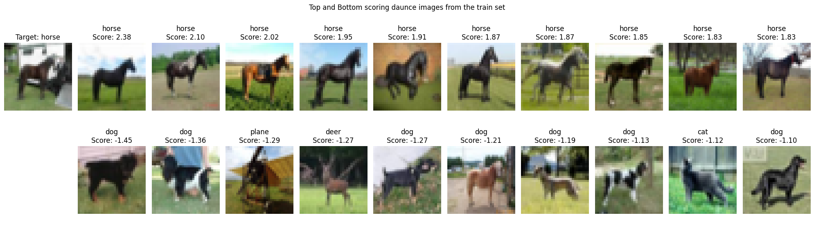

# Daunce

This is the official implementation of "[DAUNCE: Data Attribution through Uncertainty Estimation](https://arxiv.org/abs/2505.23223)". The repository contains demo implementations for different models and datasets, including CIFAR-ResNet and LLMs.

## Contents
- [Daunce on CIFAR-ResNet](cifar-resnet/README.md): Implementation of Daunce on the CIFAR-10 dataset with ResNet-9 model.



- [Daunce demo for LLMs](llm/README.md): Implementation of Daunce for LLMs, specifically for the Qwen model on a math dataset.

## To prepare the environment
1. Clone the repository:
    ```bash
    git clone https://github.com/xypan0/Daunce.git
    cd Daunce
    ```
2. Install the required packages. The `requirements.txt` file is deprecated for Daunce. Please refer to [LMFlow](https://github.com/OptimalScale/LMFlow) for enviroment setup.

## Citation
If this repo was useful to you, please consider citing our paper:
```bibtex
@article{pan2025daunce,
  title={Daunce: Data Attribution through Uncertainty Estimation},
  author={Pan, Xingyuan and Ye, Chenlu and Melkonian, Joseph and Ma, Jiaqi W and Zhang, Tong},
  journal={arXiv preprint arXiv:2505.23223},
  year={2025}
}
```